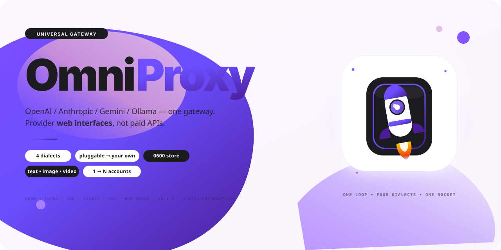

<p align="center">
<a href="README.md">Русский</a> · <a href="README.en.md">English</a> · <strong>中文</strong> · <a href="CHANGELOG.md">Changelog</a> · <a href="LICENSE">MIT</a><br/>
<strong>OmniProxy</strong> — 通用网关，适用于所有服务商网页界面
</p>

<p align="center">


</p>

# OmniProxy — 通用网关

**OmniProxy** 在服务商 **网页界面**（浏览器登录后访问的那些端点）前放置 **标准 API**（兼容 OpenAI / Anthropic / Gemini / Ollama）。无需付费 API，不被锁定，你的账号，你的网关。支持所有模态：文本、图像、视频、音频、音乐、语音、3D（通过 `provider.yaml`）。

> **状态：`v0.1.4` — 网关可运行。** `omniproxy serve` 可通过任意提供商模块以 OpenAI、Anthropic、Gemini 和 Ollama 格式响应 — 具备账号池、流式输出、并发控制和诚实的 `unverified`。**没有任何提供商已针对其线上服务验证**：所有声明为 `unverified`，仅在本地协议保真模拟器（`packages/provider-sim` 含真实 `sha3_wasm_bg`）上端到端执行。`legacy/` 仅是 **最小示例**，不是核心 — 如需请见 `legacy/README.md`。

---

## 目录

- [30 秒架构](#30-秒架构)
- [快速开始 — 一次设置，忘记它](#快速开始--一次设置忘记它)
- [认证 — token 在哪里](#认证--token-在哪里)
- [提供商 — 无需 fork](#提供商--无需-fork)
- [捕获流水线 — 从流量到声明](#捕获流水线--从流量到声明)
- [方言 — 第五种协议是一个文件](#方言--第五种协议是一个文件)
- [诊断 — 不泄露秘密的 doctor](#诊断--不泄露秘密的-doctor)
- [网关端点](#网关端点)
- [文档 — 下一步去哪里](#文档--下一步去哪里)
- [开发 — 构建和测试](#开发--构建和测试)
- [部署 — Docker 和 systemd](#部署--docker-和-systemd)
- [安全和权限](#安全和权限)
- [法律与 ToS](#法律与-tos)
- [历史和原则](#历史和原则)

---

## 30 秒架构

```
任意 SDK → 方言 (OpenAI/Anthropic/Gemini/Ollama/你的) → UMR (通用请求)
                                                                ↓
provider.yaml → 引擎 (flow, JSONPath, 变换) → HTTP → 服务商网页界面
                                                                ↓
                                                           UMS (事件流)
                                                                ↓
                                                          方言 → SDK 响应
```

- **UMR** (`packages/umr`): `flattenConversation` — 同一对话到上游是逐字节相同的 prompt。
- **UMS** (`packages/schema`): 事件 `start`/`delta`/`warning`/`error`。
- **引擎** (`packages/engine-declarative`): 模板 `{{ }}` (`?`/`null-if-empty`)、JSONPath、变换（`deepseek-pow-v0`等）、分帧 `sse`/`ndjson`/`json-patch`。
- **网关** (`packages/gateway`): 路由 `alias` → `provider`、池 `1..N`（ADR-0004）、`ConcurrencyGate` 按 `账号+通道`、提交边界（仅在首个 `content` 前重试）。
- **发现** (`discovery.ts`): `--provider-dir` > `$OMNIPROXY_PROVIDER_PATH` > `~/.omniproxy/providers/` > `providers/`（通过 CLI 自身位置回退 — 在 `/tmp` 和 Docker 中可用）。

---

## 快速开始 — 一次设置，忘记它

### 方案 A — Docker（一条命令，失败自动重启，0600 卷）

```bash
# 1) 一次性存储凭证（无 --field 时 TTY 会交互式询问 token）
docker run --rm -v omniproxy_data:/home/omniproxy/.omniproxy omniproxy:0.1.4 \
  node apps/cli/dist/main.js auth add deepseek-web --field token=你的TOKEN
# 在哪里 / 如何删除：
docker run --rm -v omniproxy_data:/home/omniproxy/.omniproxy omniproxy:0.1.4 \
  node apps/cli/dist/main.js auth path
# docker volume rm omniproxy_data

# 2) 运行
docker compose up -d && docker compose logs -f
# http://127.0.0.1:8787/health → {"status":"ok"}
```

### 方案 B — pnpm 源码（Windows 和 Linux 均为一等公民）

```bash
git clone https://github.com/shirou-eh/OmniProxy.git && cd OmniProxy
pnpm install --frozen-lockfile && pnpm run build

# 1) 凭证 (0600 文件 ~/.omniproxy/accounts.json)
node apps/cli/dist/main.js auth add deepseek-web --field token=...
node apps/cli/dist/main.js auth list
node apps/cli/dist/main.js serve --port 8787

# 2) 任意 SDK
curl http://127.0.0.1:8787/v1/chat/completions -H content-type:application/json \
  -d '{"model":"deepseek-chat","messages":[{"role":"user","content":"hi"}]}'

# 3) 诊断
node apps/cli/dist/main.js doctor --anonymized
```

密钥接受 `Authorization: Bearer` / `x-api-key` / `x-goog-api-key` / `?key=`。`GET /health|/v1/models|/v1/capabilities` 无需密钥。`0.0.0.0` 无 `--api-key` 会被 **拒绝**。

---

## 认证 — token 在哪里

```
~/.omniproxy/accounts.json  (或 $OMNIPROXY_HOME/accounts.json)
  目录 0700，文件 0600（仅所有者；Windows ACL）。永不提交。
  { "deepseek-web": {"token":"…"} }
```

`auth list` 仅显示字段名，`auth remove` 删除，`auth path` 显示路径。

---

## 提供商 — 无需 fork

```bash
omniproxy provider list
omniproxy capture record deepseek-web --auth ./auth.json
omniproxy capture sanitize <bundle> && omniproxy capture analyze <bundle> --compare <other>
omniproxy provider draft <bundle> --out ./out.yaml
```

你的 `~/.omniproxy/providers/<id>/provider.yaml` **覆盖**内置的。

---

## 捕获流水线 — 从流量到声明

声明 **仅** 来自录制的流量（§12.1）。`sanitize` → `analyze`（图和原因） → `draft`（`needs-capture` + `TODO(capture)`）。

---

## 方言 — 第五种协议是一个文件

`--dialect ./my.mjs` — 导出 `DialectPlugin` 的模块，挂载在内置之前。见 `07-writing-a-dialect.md`。

---

## 诊断 — 不泄露秘密的 doctor

```bash
omniproxy doctor --json
```

---

## 网关端点

| 方法 | 路径 | 说明 |
|---|---|---|
| `POST` | `/v1/chat/completions` | OpenAI |
| `POST` | `/v1/messages` | Anthropic |
| `POST` | `/v1beta/models/<m>:generateContent` | Gemini |
| `POST` | `/api/chat` | Ollama |
| `GET` | `/v1/models` | 所有别名 |
| `GET` | `/v1/capabilities` | 真实能力 |
| `GET` | `/health` | 状态 |

---

## 文档 — 下一步去哪里

| 文档 | 内容 |
|---|---|
| `docs/omniproxy/00-risks.md` | 诚实风险 |
| `01-monorepo.md` | 布局 |
| `02-provider-yaml.md` | 声明格式 |
| `05-reliability-charter.md` | 10 个不变量 |
| `06-hackability-charter.md` | 用户权利 |
| `07-writing-a-dialect.md` | 方言 |

---

## 开发

`pnpm install && pnpm run build && pnpm exec turbo run test --force` — 885 测试。

---

## 部署 — Docker 和 systemd

见英文版 `docker-compose.yml`。

---

## 安全和权限

`0600` 文件，`secrets-scan` CI，`timingSafeEqual`。

---

## 法律与 ToS

违反 ToS — **可能被封**。仅使用你愿意冒险的账号。MIT。

---

MIT. Purple rocket — MD3 Expressive.
